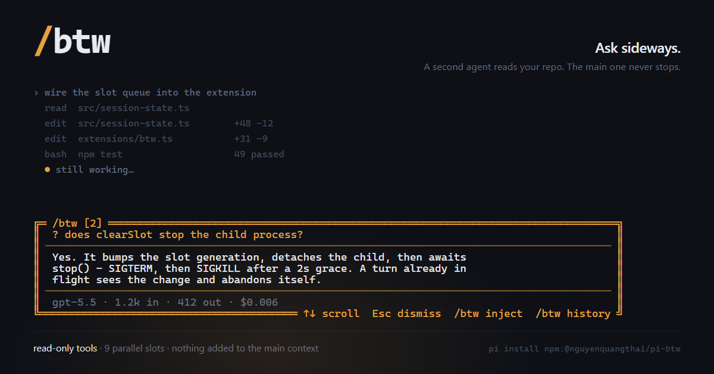

# pi-btw

[](https://www.npmjs.com/package/@nguyenquangthai/pi-btw)
[](LICENSE)

A Pi Coding Agent extension for **fast, non-blocking, parallel side questions**.



Ask quick side questions without interrupting the main agent and without bloating its context.

```text
/btw What does resolveUser do?       → instant answer view
/btw 2 Explain this error            → slot 2, independent
/btw inject                          → hand the slot answer to the main agent
```

## Features

- **⚡ Zero context overhead** — BTW runs in a separate RPC child process through Pi's resolved CLI entry (`node <pi-cli> --mode rpc --no-session --offline`). The main agent's context is never touched.
- **🔒 Safe tool access** — Child sessions explicitly enable read-only tools (`read`, `grep`, `find`, `ls`) and run with `--no-extensions`, so no extension (including this one) loads recursively.
- **🧵 Parallel slots** — 9 independent slots (1-9). Ask different questions simultaneously, each in its own session.
- **🎯 Context scoping** — The first question in a slot carries a scoped slice of the main conversation so questions like "explain this error" work. Strategies: `smart`, `last-n`, `budget`, `compact`, `full`, or `none`.
- **📡 Streaming** — Answers appear token-by-token. The first question in a slot pays a one-time child startup of roughly a second; later questions in that slot reuse the process.
- **🔇 Context isolation** — Side questions and answers never enter the main agent's context unless you inject them.
- **💉 Answer injection** — `/btw inject` hands the slot's answers to the main agent when you want them.
- **📜 Session persistence** — Slot state survives `/resume`, `/fork`, and restarts.
- **⌨️ Keyboard-first UI** — Scrollable answer view + full history browser.
- **💰 Cost tracking** — Per-answer token/cost display.
- **🔧 Flexible model config** — Defaults to `ctx.model` (same as main agent). Optionally configure a cheaper model per-slot.

## Install

```bash
pi install npm:@nguyenquangthai/pi-btw
/reload
```

Or from GitHub:

```bash
pi install git:github.com/QuangThai/pi-btw
/reload
```

Local development:

```bash
git clone https://github.com/QuangThai/pi-btw.git
cd pi-btw
npm install
pi install ./
/reload
```

## Usage

### Commands

| Command | Description |
|---------|-------------|
| `/btw <question>` | Ask in the active slot (creates slot 1 if none exists). |
| `/btw N <question>` | Ask in slot N (1-9). |
| `/btw N` | Switch to slot N. |
| `/btw inject` | Send the active slot's answers to the main agent, then clear the slot. |
| `/btw clear` | Discard the active slot's answers. |
| `/btw` | Open the side-question history browser. |

### Shortcuts

| Key | Action |
|-----|--------|
| `Alt+X` | Clear active slot (discard answers). |
| `Alt+H` | Previous slot. |
| `Alt+L` | Next slot. |
| `Alt+1…Alt+9` | Jump directly to slot N. |

> Injection is `/btw inject`, not a keyboard shortcut. Terminals disagree about
> how `Alt+<key>` is encoded, and extension shortcuts are delivered to the
> editor, so they never fire while the answer view is open. A command works in
> every terminal and from inside the answer view. If the `Alt+` keys above do
> nothing in your terminal, use `/btw N` to switch slots and `/btw clear` to
> clear one.

### Answer view

| Key | Action |
|-----|--------|
| `↑` / `↓` | Scroll answer. |
| `Esc` | Close the view. The answer keeps generating in the background and notifies you when done. |

Run `/btw inject` after closing the view to hand the answer to the main agent.

### History browser

| Key | Action |
|-----|--------|
| `↑` / `↓` or `j` / `k` | Navigate entries or scroll expanded answer. |
| `Enter` | Expand/collapse selected answer. |
| `d` | Delete entry. |
| `Esc` / `q` | Close. |

## Settings

Global settings at `~/.pi/agent/btw-settings.json`:

```json
{
  "maxTokens": 1000,
  "maxContextTokens": 8000,
  "strategy": "smart",
  "recentExchanges": 8
}
```

| Setting | Default | Description |
|---------|---------|-------------|
| `maxTokens` | `1000` | Max output tokens per answer. Applies to the inline fallback only; the RPC child uses the model's own limit. |
| `maxContextTokens` | `8000` | Max context tokens to include (strategy-dependent). |
| `strategy` | `"smart"` | Context scoping: `"smart"`, `"last-n"`, `"budget"`, `"compact"`, `"none"`, `"full"`. |
| `recentExchanges` | `8` | Recent exchanges to keep when strategy is `"last-n"`. |
| `btwProvider` | _(optional)_ | Separate provider for BTW (cheaper model). Uses `ctx.model` if unset. |
| `btwModelId` | _(optional)_ | Separate model ID for BTW. |
| `slotModels` | _(optional)_ | Per-slot model overrides. Array of `{ provider, modelId }` per slot. |

### Context strategies

| Strategy | Description | Typical tokens |
|---|---|---|
| `"none"` | No context — fastest, cheapest. | 0 |
| `"compact"` | Use compaction summary + latest exchanges. | ~500-2k |
| `"smart"` | Skip tool results, stay within budget. | ~2-8k |
| `"last-n"` | Keep N recent exchanges. | ~4-10k |
| `"budget"` | Walk backwards up to token budget. | Configurable |
| `"full"` | All context. | 100k+ |

Context is sent once per slot, on the first question. Follow-up questions in the
same slot reuse the child's own conversation instead of resending it.

### Per-slot model example

```json
{
  "slotModels": [
    { "provider": "openai", "modelId": "gpt-4o-mini" },
    null,
    { "provider": "anthropic", "modelId": "claude-sonnet-4-20250514" }
  ]
}
```

Slot 1 → gpt-4o-mini (cheap), Slot 3 → claude-sonnet (powerful), Slot 2 → default (ctx.model).

> **Note:** Without `btwProvider`/`btwModelId`/`slotModels`, BTW uses the same model as the main agent — no extra API key needed.

## Architecture

```
extensions/btw.ts         Extension entry: commands, shortcuts, UI, context filter
src/
├── btw-child.ts          RPC child process (resolved Pi CLI + read-only tools)
├── session-state.ts      Slot manager (9 slots, queue, turns, restore)
└── types.ts              Shared TypeScript types
```

### Flow

```
User: /btw 2 "explain this error"
  │
  ├─ ensureSlot(state, 1) → create/switch to slot 2
  ├─ resolveBtwModel(slotIndex=1) → slotModels[1] → btwProvider/btwModelId → ctx.model
  ├─ provider visible to a --no-extensions child? no → inline fallback, with a warning
  ├─ queueQuestionToSlot() → push turn onto slot 2's serial queue
  │   ├─ BtwChild.spawn(process.execPath, "<pi-cli> --mode rpc --no-session --offline --tools read,grep,find,ls")
  │   ├─ first turn only: prepend scoped main-session context
  │   ├─ JSONL RPC: { type: "prompt", message, streamingBehavior: "followUp" }
  │   ├─ Events: message_update (streaming) → agent_end/agent_settled (done)
  │   └─ on failure: drop the dead child, answer inline, mark the turn viaFallback
  ├─ turn.partial → answer view redraws (Esc closes the view, turn keeps running)
  ├─ turn settles → usage recorded per turn, persisted with its slot number
  └─ /btw inject → pi.sendUserMessage(injectionText(slot.turns)) → into the main chat
```

## Development

```bash
npm install
npm run typecheck    # tsc --noEmit (zero errors expected)
npm test             # unit tests, extension harness, TUI render, RPC handshake
```

Two checks need real credentials and spend tokens, so they are not part of
`npm test`:

```bash
# One real read-tool call through the RPC child.
BTW_SMOKE_MODEL=provider/model npm run smoke:rpc

# Full flow in a real Pi session: cold start, tools, slot reuse, slot
# exhaustion, answer injection, restore after restart.
BTW_E2E_MODEL=provider/model npm run e2e
```

```powershell
# PowerShell
$env:BTW_E2E_MODEL="provider/model"; npm run e2e
```

## Package structure

```
pi-btw/
├── package.json              Pi + npm package metadata
├── README.md                 This file
├── CHANGELOG.md
├── LICENSE                   MIT
├── assets/
│   └── pi-btw-gallery.png
├── extensions/
│   └── btw.ts                Extension entry point
├── src/
│   ├── btw-child.ts          RPC child process
│   ├── session-state.ts      Slot state management
│   └── types.ts              Shared types
├── scripts/
│   ├── build-gallery.mjs     Regenerates the gallery image's HTML source
│   ├── e2e-btw.mts           Live end-to-end check
│   ├── e2e-probe.ts          Probe extension used by the e2e check
│   └── rpc-tool-smoke.mts    Live read-tool smoke test
├── test/
│   ├── btw-child.test.mts    Launcher, handshake, error formatting
│   ├── extension.test.mts    Shortcuts, context filter, TUI rendering
│   └── session-state.test.mts  Slot allocation, queue, persistence
└── tsconfig.json
```

## Security and limits

- The child runs in your project's working directory with `read`, `grep`, `find`, and `ls`. A side question can read files the main agent can read. It cannot write, edit, or run shell commands.
- The child inherits the parent process environment, including provider credentials. That is what lets it use the same model without a second login.
- Providers registered by another extension via `pi.registerProvider()` are invisible to the child, which runs with `--no-extensions`. BTW detects this up front and answers inline (no tools) with a warning. Set `btwProvider`/`btwModelId` to a built-in provider or one from `models.json` for full `/btw`.
- Logs go to `~/.pi/agent/btw.log` and roll over at 512 KB.

## License

MIT
